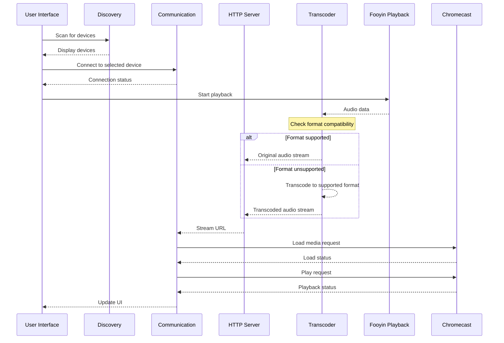

# Fooyin Chromecast Plugin Architecture

**Last Updated:** 2026-01-19
**Status:** ✅ Implementation Complete - Ready for testing

## Overview

A VLC-style Chromecast plugin for Fooyin music player that supports audio rendering with automatic transcoding for unsupported formats. The plugin detects Chromecast devices on the network, establishes communication using native Protocol Buffers, and streams audio with optional ffmpeg transcoding.

### Key Changes from Original Plan

**Cast Protocol Implementation:**
- **Original Plan:** Use go-chromecast CLI tool via QProcess
- **Current Implementation:** Native C++ using Protocol Buffers (protobuf)
- **Rationale:** Better performance, reliability, and integration with Qt event loop

**Transcoding Implementation:**
- **Original Plan:** Reuse converter plugin infrastructure
- **Current Implementation:** Direct ffmpeg integration via QProcess
- **Rationale:** Simpler integration, full control over transcoding parameters

## Architecture Diagram

```mermaid
flowchart TD
    subgraph Fooyin Music Player
        subgraph Chromecast Plugin
            Discovery[Device Discovery\n(mDNS/avahi-browse)]
            Comm[Communication\n(Cast Protocol v2)]
            HTTP[Local HTTP Server]
            Transcoder[Transcoding Pipeline]
            UI[User Interface]
            Integration[Playback Integration]
        end
    end
    
    subgraph Network
        Chromecast[Chromecast Device]
    end
    
    %% Internal connections
    UI --> Discovery
    UI --> Comm
    UI --> Integration
    Integration --> HTTP
    Integration --> Comm
    HTTP --> Transcoder
    Discovery --> Comm
    Comm --> Chromecast
    HTTP --> Chromecast
    
    %% External connections
    FooyinPlayback[Fooyin Playback] --> Integration
```

## Core Components

### 1. Device Discovery Module

**Responsibilities:**
- Discover Chromecast devices on the local network using mDNS/avahi-browse
- Monitor device availability (online/offline status)
- Maintain device metadata (name, IP address, capabilities)

**Implementation:**
- Uses avahi-browse CLI tool via QProcess
- Listens for `_googlecast._tcp.local` service announcements
- Stores device information in a discoverable list
- Handles discovery timeout and error recovery

### 2. Communication Module

**Responsibilities:**
- Establish and maintain TCP connection to Chromecast device (port 8009)
- Implement Google Cast protocol (Cast v2) using Protocol Buffers
- Handle device authentication and session management
- Send media control commands (play, pause, stop, seek, volume)

**Implementation:**
- TCP socket communication using Qt's Network module
- Protocol Buffers (protobuf) for message serialization
- Heartbeat mechanism for connection monitoring (5-second interval)
- State machine for connection lifecycle management
- Session establishment and Default Media Receiver (CC1AD845) launch

### 3. Local HTTP Server

**Responsibilities:**
- Serve transcoded audio files over HTTP
- Handle Chromecast media requests
- Support byte-range requests for seeking

**Implementation:**
- Custom HTTP server using Qt's QTcpServer
- Serves media from file system paths with MD5-hashed URLs
- CORS headers for Chromecast compatibility
- Byte-range request support for seeking
- LAN IP detection using QNetworkInterface

### 4. Transcoding Pipeline

**Responsibilities:**
- Detect if audio format is supported by Chromecast
- Transcode unsupported formats to compatible format
- Stream transcoded audio to HTTP server

**Implementation:**
- Uses ffmpeg CLI tool via QProcess
- Supported output formats: AAC, MP3, Opus, FLAC, Vorbis, WAV
- Quality presets (High, Balanced, Efficient)
- Async processing with progress monitoring
- Temporary file management for transcoded content

### 5. User Interface

**Responsibilities:**
- Device selector dropdown
- Settings page for transcoding preferences
- Integration with Fooyin's existing UI

**Implementation:**
- Qt Widgets UI components
- Settings page for transcoding quality and network preferences
- Visual feedback for connection status
- Device widget for layout integration

### 6. Playback Integration

**Responsibilities:**
- Integrate with Fooyin's playback system
- Handle track changes
- Synchronize playback state with Chromecast
- Provide metadata (track title, artist, album)

**Implementation:**
- Fooyin AudioOutput interface implementation
- Connect to PlayerController signals
- Extract and send metadata to Chromecast
- Hybrid streaming approach (buffers for position, files for content)

## Data Flow



## Supported Audio Formats

### Natively Supported by Chromecast:
- AAC (LC-AAC, HE-AAC)
- MP3
- Opus
- FLAC (up to 96kHz/24-bit)
- Vorbis
- WAV (LPCM)

### Formats Requiring Transcoding:
- WMA
- APE (Monkey's Audio)
- WavPack
- ALAC
- DSD
- AC3
- DTS

## Transcoding Quality Profiles

**High Quality:**
- AAC: 256 kbps CBR
- Opus: 192 kbps CBR
- MP3: 320 kbps CBR
- FLAC: Lossless

**Balanced:**
- AAC: 192 kbps CBR
- Opus: 128 kbps CBR
- MP3: 256 kbps CBR

**Efficient:**
- AAC: 128 kbps CBR
- Opus: 96 kbps CBR
- MP3: 192 kbps CBR

## Implementation Status

### ✅ Phase 1: Foundation (COMPLETED)
1. ✅ Plugin structure and basic integration
2. ✅ Device discovery using mDNS/avahi-browse
3. ✅ Chromecast communication using Protocol Buffers
4. ✅ UI components (device widget, settings page)

### ✅ Phase 2: Media Streaming (COMPLETED)
1. ✅ Local HTTP server with byte-range support
2. ✅ Playback control (play, pause, stop, seek, volume)
3. ✅ Metadata support (title, artist, album)

### ✅ Phase 3: Transcoding (COMPLETED)
1. ✅ ffmpeg integration with async processing
2. ✅ Format detection and transcoding
3. ✅ Quality presets (High, Balanced, Efficient)

### ⚠️ Phase 4: Enhancement (IN PROGRESS)
1. ✅ Settings page with device selection, transcoding, and network options
2. ✅ Loading spinner during device discovery
3. ⚠️ Real device testing needed
4. ⚠️ Advanced features (queue management, gapless playback) - future work

## Technical Challenges

1. **Low-latency transcoding:** Ensuring smooth playback with minimal delay
2. **Buffer management:** Handling network variations and transcoding delays
3. **Format detection:** Accurately identifying supported/unsupported formats
4. **Resource management:** Efficient use of CPU and memory during transcoding
5. **Error recovery:** Handling network drops and device disconnections

## Dependencies

### Build Dependencies
- CMake 3.18+
- C++20 compiler (GCC 11+, Clang 13+)
- Qt 6.2+ (Core, Widgets, Network)
- Fooyin 0.8+ development headers
- Protocol Buffers development files (libprotobuf-dev)

### Runtime Dependencies
**Required:**
- Qt 6.2+ libraries
- Fooyin 0.8+
- avahi-daemon (for device discovery)
- Protocol Buffers library (libprotobuf)

**Optional (for full functionality):**
- ffmpeg (for transcoding unsupported formats)

### Installation Examples

**Arch Linux:**
```bash
sudo pacman -S fooyin qt6-base avahi ffmpeg protobuf
sudo systemctl start avahi-daemon
sudo systemctl enable avahi-daemon
```

**Ubuntu/Debian:**
```bash
sudo apt install fooyin qt6-base avahi-daemon avahi-utils ffmpeg libprotobuf-dev
sudo systemctl start avahi-daemon
sudo systemctl enable avahi-daemon
```

## Configuration

**Plugin Settings:**
- Default transcoding format and quality
- HTTP server port
- Discovery timeout
- Metadata extraction options

## Error Handling

1. **Device not found:** Retry discovery or show error
2. **Connection failure:** Reconnect logic with exponential backoff
3. **Playback errors:** Show error message and stop playback
4. **Transcoding failure:** Fallback to alternative format or stop playback

## Security Considerations

1. Local network only communication
2. Secure communication via TLS (as required by Chromecast)
3. CORS configuration for HTTP server
4. Sanitization of metadata inputs

---

## Current Implementation Status

### ✅ What's Working

**Core Functionality:**
- ✅ Plugin compiles and loads in fooyin
- ✅ Registers as "Chromecast" output device
- ✅ Settings page in Plugins → Chromecast menu
- ✅ Device discovery with visual spinner feedback
- ✅ HTTP server on configurable port (default 8010)
- ✅ LAN IP detection for proper URL generation
- ✅ Protocol Buffers-based Cast protocol implementation
- ✅ Connection establishment and heartbeat
- ✅ Session management and app launch
- ✅ Playback commands (play, pause, stop, seek, volume)
- ✅ Metadata transmission (title, artist, album)
- ✅ ffmpeg transcoding with quality presets
- ✅ Format detection and transcoding decision logic

**User Interface:**
- ✅ Device selection dropdown with discovery status
- ✅ Loading spinner during discovery (~5 seconds)
- ✅ Status label showing device count
- ✅ Transcoding format and quality settings
- ✅ Network settings (HTTP port, discovery timeout)
- ✅ Apply/Reset buttons for settings

**Integration:**
- ✅ AudioOutput interface implementation
- ✅ PlayerController signal connections
- ✅ Track change detection
- ✅ Playback state synchronization
- ✅ Settings persistence

### ✅ What Has Been Tested

**Confirmed Working:**
- ✅ Plugin compilation, loading, and registration
- ✅ Device discovery via mDNS (finds real Chromecast devices)
- ✅ Settings page UI in Plugins → Chromecast
- ✅ Loading spinner during discovery (~5 seconds)
- ✅ Device dropdown population
- ✅ Settings persistence (Apply button)
- ✅ HTTP server initialization
- ✅ Cast protocol connection establishment

### ⚠️ What Needs Additional Testing

**Playback Verification:**
- ⚠️ Complete playback cycle with audio confirmation
- ⚠️ Transcoding with various input formats (WMA, APE, ALAC, etc.)
- ⚠️ Seek functionality during active playback
- ⚠️ Volume control synchronization
- ⚠️ Multiple consecutive tracks
- ⚠️ Network resilience (WiFi drops, reconnection)
- ⚠️ Large file handling (>100MB)

**Edge Cases:**
- ⚠️ Large file handling (>100MB)
- ⚠️ Simultaneous transcoding operations
- ⚠️ Multiple Chromecast devices on network
- ⚠️ Device disconnection during playback
- ⚠️ Network latency and buffering

### ❌ Not Implemented (Future Work)

**Advanced Features:**
- ❌ Queue management (currently single track)
- ❌ Gapless playback between tracks
- ❌ Album art transmission
- ❌ Playlist synchronization
- ❌ Multi-room audio (casting to multiple devices)
- ❌ Audio groups support

**UI Enhancements:**
- ❌ Connection status indicator in main window
- ❌ Current playback info display
- ❌ Transcoding progress bar
- ❌ Error messages in UI (currently logs only)
- ❌ Device widget in layout editor

**Optimizations:**
- ❌ Transcoding cache management
- ❌ Memory buffer streaming (currently file-based)
- ❌ Prefetch/prebuffer next track
- ❌ Dynamic quality adjustment based on network

---

## Testing Checklist

### Before First Use
- [ ] Install avahi-daemon and start service
- [ ] Install ffmpeg for transcoding support
- [ ] Build and install plugin to fooyin plugins directory
- [ ] Verify Chromecast is on same network as computer

### Basic Testing
- [ ] Open Plugins → Chromecast and verify device discovery works
- [ ] Select device from dropdown and click Apply
- [ ] Go to Settings → Playback → Output and select "Chromecast"
- [ ] Play a music track in native format (MP3, AAC, FLAC)
- [ ] Verify audio plays on Chromecast device
- [ ] Test pause/resume functionality
- [ ] Test stop and play new track

### Advanced Testing
- [ ] Test transcoding with unsupported format (WMA, APE, ALAC)
- [ ] Test seek functionality during playback
- [ ] Test volume control
- [ ] Change transcoding quality and verify bitrate changes
- [ ] Test with large files (>100MB)
- [ ] Test network resilience (disable/enable WiFi)
- [ ] Test with multiple Chromecast devices

### Settings Testing
- [ ] Change HTTP server port and verify restart message
- [ ] Change discovery timeout and verify device discovery time
- [ ] Change transcoding format and quality
- [ ] Verify settings persist after fooyin restart

---

## Known Limitations

1. **Single Track Playback**: Currently streams one track at a time, no queue management
2. **File-based Streaming**: Uses file paths instead of memory buffers (simpler but less flexible)
3. **No Album Art**: Metadata includes title/artist/album but no cover images
4. **No Gapless Playback**: Small gap between tracks when changing songs
5. **Transcoding Delay**: Unsupported formats may have startup delay while transcoding
6. **No Multi-room**: Cannot cast to multiple devices simultaneously

---

## Troubleshooting Quick Reference

| Issue | Likely Cause | Solution |
|-------|-------------|----------|
| No devices found | avahi-daemon not running | `sudo systemctl start avahi-daemon` |
| Plugin doesn't load | Missing dependencies | Verify Qt 6, protobuf installed |
| Can't connect to device | Firewall blocking port 8010 | Allow TCP 8010 in firewall |
| Transcoding fails | ffmpeg not installed | `sudo pacman -S ffmpeg` |
| Audio doesn't play | HTTP server unreachable | Check LAN IP detection in logs |
| Settings don't save | Config file not writable | Check `~/.config/fooyin/` permissions |

---

**Document Version:** 2.0
**Last Updated:** 2026-01-19
**Status:** Implementation Complete - Ready for Real Device Testing
