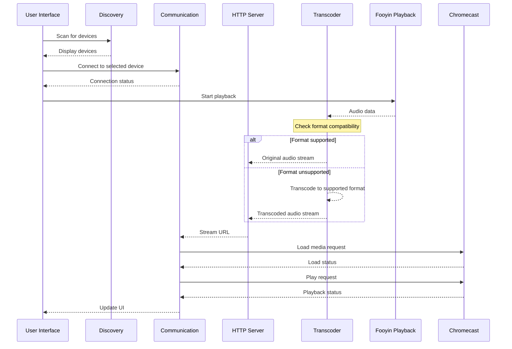

# Fooyin Chromecast Plugin Architecture

## Overview

A VLC-style Chromecast plugin for Fooyin music player that supports audio rendering with automatic transcoding for unsupported formats. The plugin will detect Chromecast devices on the network, establish communication, and stream audio with optional transcoding.

## Architecture Diagram

```mermaid
flowchart TD
    subgraph Fooyin Music Player
        subgraph Chromecast Plugin
            Discovery[Device Discovery\n(mDNS/SSDP)]
            Comm[Communication\n(Google Cast Protocol)]
            HTTP[Local HTTP Server]
            Transcoder[Transcoding Pipeline]
            UI[User Interface]
            Integration[Playback Integration]
        end
        
        subgraph Existing Converter Plugin
            CodecWrappers[Codec Wrappers\n(MP3, FLAC, Opus, Ogg)]
            ConversionManager[Conversion Manager]
        end
    end
    
    subgraph Network
        Chromecast[Chromecast Device]
    end
    
    %% Internal connections
    UI --> Discovery
    UI --> Comm
    UI --> Integration
    Integration --> HTTP
    Integration --> Comm
    HTTP --> Transcoder
    Transcoder --> CodecWrappers
    Discovery --> Comm
    Comm --> Chromecast
    HTTP --> Chromecast
    
    %% External connections
    FooyinPlayback[Fooyin Playback] --> Integration
    CodecWrappers --> ConversionManager
```

## Core Components

### 1. Device Discovery Module

**Responsibilities:**
- Discover Chromecast devices on the local network using mDNS/SSDP
- Monitor device availability (online/offline status)
- Maintain device metadata (name, IP address, capabilities)

**Implementation:**
- Use Qt's Network module for mDNS discovery
- Listen for `_googlecast._tcp.local` service announcements
- Store device information in a discoverable list

### 2. Communication Module

**Responsibilities:**
- Establish and maintain TCP connection to Chromecast device (port 8009)
- Implement Google Cast protocol (protobuf-based)
- Handle device authentication and session management
- Send media control commands (play, pause, stop, seek, volume)

**Implementation:**
- Use Qt's Network and WebSocket modules
- Protocol buffers for message serialization
- State machine for connection lifecycle management

### 3. Local HTTP Server

**Responsibilities:**
- Serve transcoded audio files over HTTP
- Handle Chromecast media requests
- Support byte-range requests for seeking

**Implementation:**
- Qt's HttpServer module (Qt 6.4+) or embedded HTTP server library
- Serve media from memory buffer or temporary files
- CORS headers for Chromecast compatibility

### 4. Transcoding Pipeline

**Responsibilities:**
- Detect if audio format is supported by Chromecast
- Transcode unsupported formats to compatible format
- Stream transcoded audio to HTTP server

**Implementation:**
- Reuse existing CodecWrapper architecture
- Supported output formats: AAC, MP3, Opus, FLAC, Vorbis, WAV
- On-the-fly transcoding using QProcess
- Buffer management for smooth playback

### 5. User Interface

**Responsibilities:**
- Device selector dropdown
- Playback control buttons (play, pause, stop, volume)
- Status indicator (connected, buffering, playing, paused)
- Integration with Fooyin's existing UI

**Implementation:**
- Qt Widgets or Qt Quick UI components
- Settings page for transcoding quality preferences
- Visual feedback for connection status

### 6. Playback Integration

**Responsibilities:**
- Integrate with Fooyin's playback system
- Handle track changes
- Synchronize playback state with Chromecast
- Provide metadata (track title, artist, album, cover art)

**Implementation:**
- Fooyin plugin interface integration
- Connect to playback events
- Extract and send metadata

## Data Flow



## Supported Audio Formats

### Natively Supported by Chromecast:
- AAC (LC-AAC, HE-AAC)
- MP3
- Opus
- FLAC (up to 96kHz/24-bit)
- Vorbis
- WAV (LPCM)

### Formats Requiring Transcoding:
- WMA
- APE (Monkey's Audio)
- WavPack
- ALAC
- DSD
- AC3
- DTS

## Transcoding Quality Profiles

**High Quality (Default):**
- AAC: 256 kbps VBR
- Opus: 192 kbps VBR
- MP3: 320 kbps CBR
- FLAC: Lossless

**Balanced:**
- AAC: 192 kbps VBR
- Opus: 128 kbps VBR
- MP3: 256 kbps CBR

**Efficient:**
- AAC: 128 kbps VBR
- Opus: 96 kbps VBR
- MP3: 192 kbps CBR

## Implementation Phases

### Phase 1: Foundation
1. Create plugin structure and basic integration
2. Implement device discovery
3. Establish Chromecast communication
4. Create simple UI components

### Phase 2: Media Streaming
1. Develop local HTTP server
2. Implement basic playback control
3. Add metadata support

### Phase 3: Transcoding
1. Integrate existing converter plugin functionality
2. Implement format detection and transcoding
3. Optimize buffer management

### Phase 4: Enhancement
1. Add advanced playback features
2. Optimize performance
3. Add error handling and recovery

## Technical Challenges

1. **Low-latency transcoding:** Ensuring smooth playback with minimal delay
2. **Buffer management:** Handling network variations and transcoding delays
3. **Format detection:** Accurately identifying supported/unsupported formats
4. **Resource management:** Efficient use of CPU and memory during transcoding
5. **Error recovery:** Handling network drops and device disconnections

## Dependencies

- Qt 6.2+
- Fooyin 0.8+
- Protocol Buffers (for Cast protocol)
- Existing converter plugin codecs (flac, lame, opus-tools, vorbis-tools)

## Configuration

**Plugin Settings:**
- Default transcoding format and quality
- HTTP server port
- Discovery timeout
- Metadata extraction options

## Error Handling

1. **Device not found:** Retry discovery or show error
2. **Connection failure:** Reconnect logic with exponential backoff
3. **Playback errors:** Show error message and stop playback
4. **Transcoding failure:** Fallback to alternative format or stop playback

## Security Considerations

1. Local network only communication
2. Secure communication via TLS (as required by Chromecast)
3. CORS configuration for HTTP server
4. Sanitization of metadata inputs
